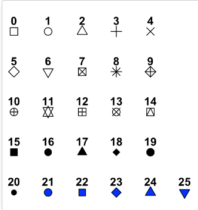
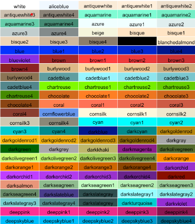
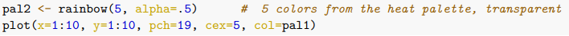
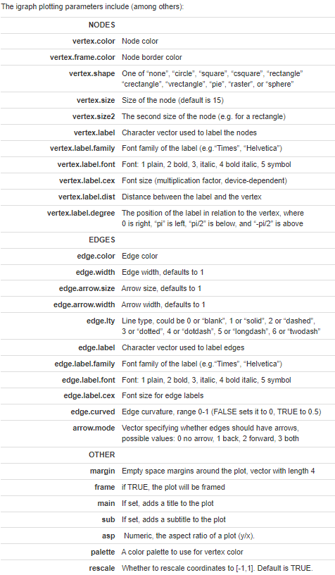

# Outstanding Questions

* <span style="color: red;">Question 1: As for column titles, can these be anything? Lastly, what needs to be consistent across data sources (for example, does 'id' need to be in this particular format?)</span> <br>

* <span style="color: red;">Question 2: What is the specific format that netplot requires things to be in?</span> <br>

* <span style="color: red;">Question 3: In this particular data set, it is interesting to note that there is no baseline for what the map should look like. How does it determine how to sort these things? </span> <br>


# Source
This was all pulled from [this website](https://kateto.net/network-visualization).

# Important Packages
  * igraph
  * network
  * sna
  * ggraph
  * visNetwork
  * threejs
  * networkD3
  * ndtv

# Colors Exploration

* x: point coordinate

* y: point coordinate

* pch: point symbol shape <br>

  * [Source](http://www.sthda.com/english/wiki/r-plot-pch-symbols-the-different-point-shapes-available-in-r)<br>

* cex: point size
  * In R, the cex parameter is used to specify the size of text and symbols in a plot. Here are some of the commonly used options for cex: <br>
    * Numeric values greater than 1 will increase the size of the text or symbol.
    * Numeric values between 0 and 1 will decrease the size of the text or symbol.
    * 1 is the default size. <br>
  * You can specify the cex parameter in a plot function, such as plot() or text(), to change the size of the text or symbols. For example, plot(x, y, cex = 1.5) will plot the points with text and symbols 1.5 times larger than the default size.<br>

* col: color <br>
  * Names: <br>

  * Number: RRGGBB. Ranges from 00 to FF. Using a hex color picker is the best mode here <br>
  
  * RGB: choosing between 0 and 1. red, green, blue percentages. <br>
  
  * pal: can also set things under their own pallet. 
  
  
* alpha: opacity / transparency. from 0-1. Needs to be inside "col" <br>

* par: set parameters of the plot. [Source to find more](https://www.rdocumentation.org/packages/graphics/versions/3.6.2/topics/par)

<br>

## Playing Around 

Dope, now lets play with what we have learned a bit. 
```{r}
plot(x=1:10, y=rep(5,10), pch=19, cex=3, col="dark red")

```

```{r}
plot(x=1:10, y=rep(5,10), pch=8, cex=1, col="cyan")

```

```{r}
par(bg="gray40")
plot(x=1:10, y=rep(5,10), pch=15, cex=15, col=rgb(.8, .1, 1, alpha = .2))

```

# Data Exploration 
* The shape of the node signals are often hard to see and left off
* Nodes: specific data points
* Links: connections between them 
<br>
```{r}
nodes <- read.csv(file = "files/network 5.16/Dataset1-Media-Example-NODES.csv", header=T, as.is=T)
links <- read.csv("files/network 5.16/Dataset1-Media-Example-EDGES.csv", header=T, as.is=T)

# lets see what the data looks like 
head(nodes)
head(links)
```
<mark >***Question 1***</mark>  


* Raw data needs to be changed to an igraph network object (<mark >***Question 2***</mark>). This is done using 'graph_from_data_frame()'
  * 'd': edges (links in this example). *The first two columns need to be the ID of the source and target for each edge*. Attributes can follow.
  * 'vertices': nodes. *The first column needs to be the id of the node*. Attributes can follow. 
  

```{r message=FALSE, warning=FALSE}
library('igraph')
net <- graph_from_data_frame(d=links, vertices=nodes, directed=T)
net

```

```{r message=FALSE, warning=FALSE}
E(net)       # The edges of the "net" object
V(net)       # The vertices of the "net" object
E(net)$type  # Edge attribute "type"
V(net)$media # Vertex attribute "media"

# Get an edge list or a matrix:
as_edgelist(net, names=T)
as_adjacency_matrix(net, attr="weight")

# Or data frames describing nodes and edges:
as_data_frame(net, what="edges")
as_data_frame(net, what="vertices")
```
* This is cool because it lets us see some of the specifics. This helps me frame things easier in my mind. I feel like this helps me conceptualize the data a little bit better, as it shows where the edges should be as well as how the edges are. Also, the vertexes would be what is considered the different aspects having a relationship, while the edges show the relationship itself. (<mark >***Question 3***</mark>) 
<br>

## Now, let's plot the thing:
```{r message=FALSE, warning=FALSE}
plot(net) # not a pretty picture!

```

<br>

* Interestingly, there is a loop you can see from s06 to itself. Those loops can be removed:

```{r message=FALSE, warning=FALSE}
net <- simplify(net, remove.multiple = F, remove.loops = T) 

plot(net, edge.arrow.size=.4,vertex.label=NA)

```

<br>

* This plot looks okay, but let's play with it now, shall we? The options are listed below:


<br>

```{r message=FALSE, warning=FALSE}
plot(net, vertex.color="lightblue", vertex.shape="square", edge.curved=0, vertex.label=NA, edge.lty=4, arrow.mode=3, edge.color="lightpink", frame=TRUE, edge.arrow.size=.15)
```

<br>

* If we want to change the labels to text, we can do so by doing this:

```{r message=FALSE, warning=FALSE}
V(net)$media

plot(net, vertex.label=V(net)$media, vertex.color="lightblue", vertex.shape="square", edge.curved=0, vertex.label=NA, edge.lty=4, arrow.mode=3, edge.color="lightpink", frame=TRUE, edge.arrow.size=.15, vertex.frame.color="#ffffff", vertex.label.color="black")
```

<br>

* Now, how about changing things based on the igrapj object?

<br>


```{r message=FALSE, warning=FALSE}
# Generate colors based on media type:
colrs <- c("darkgreen", "gray", "black")
V(net)$color <- colrs[V(net)$media.type]

# Compute node degrees (#links) and use that to set node size:
deg <- degree(net, mode="all")
V(net)$size <- deg*1
V(net)$size <- V(net)$audience.size*0.6
V(net)$label <- NA
E(net)$width <- E(net)$weight/6

plot(net)
```


```{r}
plot(net, vertex.shape="none", vertex.label=V(net)$media, 
     vertex.label.font=2, vertex.label.color="gray40",
     vertex.label.cex=.7, edge.color="gray85")
```

